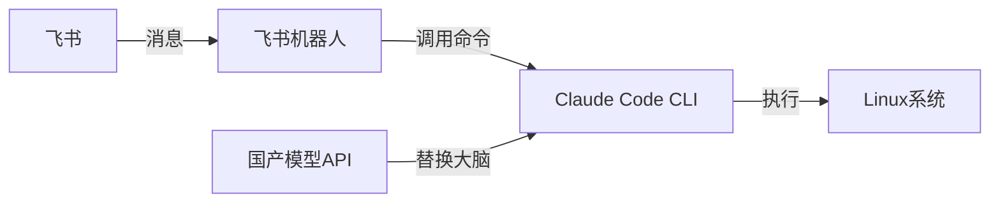
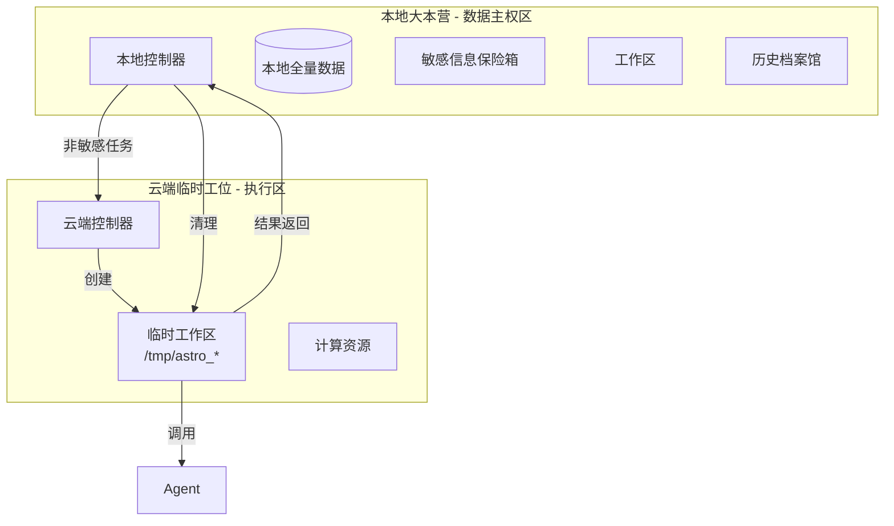
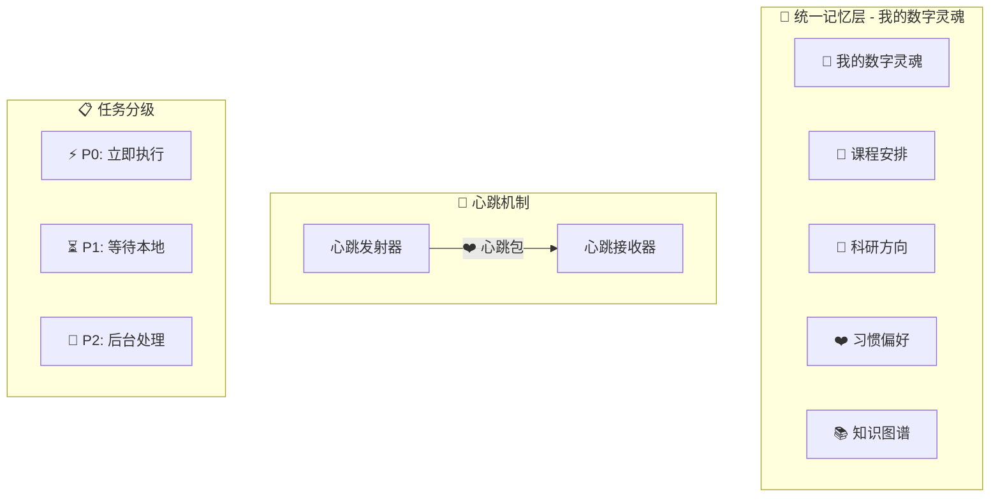
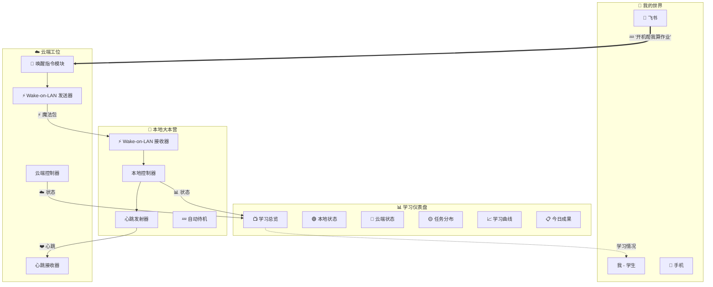

# AstroRealm 架构演进全记录

> 一个非科班学生的系统架构学习笔记
> 从v1.0到v1.7的完整思考过程

---

## 📖 写在前面

**免责声明**：我不是计算机专业学生，这些架构设计可能有很多不专业的地方。但我把所有的思考过程都记录下来，包括困惑、错误和修正。希望这份记录能帮助到和我一样从零开始的同学。

**记录原则**：
1. 保留所有原始思考，不"美化"错误
2. 标注每个阶段的困惑和解决方案
3. 记录为什么选择某个方案而不是另一个
4. 保持非科班的视角和语言

---

## 🏗️ 架构演进时间线

### 第一阶段：demo版（2026-03-15）
**核心问题**：如何让AI能操作我的电脑？

**我的困惑**：
- Agent需要什么权限才安全？
- 如何在Windows和Linux之间选择？
- 数据怎么隔离才安全？

**解决方案**：
```
方案选择：Linux + Docker沙盒
理由：
1. Linux权限控制更严格（作为新手，我觉得Linux更"安全"）
2. Docker可以隔离环境（防止AI乱搞我的系统）
3. 单独硬盘部署（物理隔离，最安心）
```

**架构图**：


**学到的东西**：
1. Linux基础命令（cd, ls, chmod等）
2. Docker基本概念（镜像、容器、卷）
3. 权限最小化原则

---

### 第二阶段：v1.0（2026-03-16）
**核心问题**：如何实现7×24小时在线？

**我的困惑**：
- 本地电脑不可能一直开机
- 云端部署又担心数据安全
- 如何平衡本地和云端？

**关键洞察**：
> **"本地集权，云端为辅"**
> 
> 所有核心数据在本地，云端只做计算执行
> 云端用完即焚，不留任何数据

**架构设计**：


**技术选择**：
- **本地存储**：直接文件系统（简单可靠）
- **云端执行**：临时Docker容器（用完即删）
- **通信协议**：HTTP + WebSocket（现学现用）

**遇到的坑**：
1. 文件同步问题（本地和云端文件不一致）
2. 网络延迟影响体验
3. 临时容器清理不彻底

---

### 第三阶段：v1.5（2026-03-18）
**核心问题**：如何让系统更智能？

**背景**：作为学生，我需要系统理解我的学习节奏和任务优先级。

**智能增强模块**：

#### 1. 智能任务分类器
```python
class TaskClassifier:
    """根据任务内容自动选择执行位置"""
    
    def classify(self, command):
        # 学生特有的敏感词
        student_sensitive = ['成绩', '考试', '作业', '论文', '导师']
        
        # 专业相关计算任务
        major_tasks = ['结构', '力学', '桥梁', '荷载', '计算']
        
        # 学习相关任务
        study_tasks = ['学习', '复习', '笔记', '整理']
        
        if any(k in command for k in student_sensitive):
            return 'local_only'  # 涉及学业隐私，只在本地
        
        elif any(k in command for k in major_tasks):
            return 'cloud_prefer'  # 专业计算，优先云端
            
        elif any(k in command for k in study_tasks):
            return 'local_prefer'  # 学习整理，优先本地
            
        else:
            return 'auto'  # 自动判断
```

#### 2. 学生专属工作流
```yaml
# 课设工作流模板（根据我的实际需求设计）
course_design_workflow:
  - name: 需求分析
    agent: ClaudeCode
    input: 课设要求文档
    output: 需求分析报告
    
  - name: 资料检索
    agent: DeepSeek
    input: 需求分析报告
    output: 相关论文和规范
    
  - name: 方案设计
    agent: ClaudeCode
    input: 资料汇总
    output: 设计方案
    
  - name: 计算验证
    agent: 本地Python
    input: 设计方案
    output: 计算结果
    
  - name: 报告生成
    agent: ClaudeCode
    input: 所有中间结果
    output: 完整课设报告
```

#### 3. 知识库结构
```
~/astrorealm/knowledge/
├── courses/              # 课程资料
│   ├── 土力学/
│   ├── 结构力学/
│   └── 桥梁工程/
├── projects/             # 项目文档
│   ├── AstroRealm/
│   └── 其他项目/
├── code_snippets/        # 代码片段
│   ├── python/
│   ├── matlab/
│   └── 其他/
└── study_notes/          # 学习笔记
    ├── AI学习/
    ├── 专业学习/
    └── 技术学习/
```

**设计思考**：
1. **以学生为中心**：所有功能围绕学生的学习需求设计
2. **渐进式复杂**：从简单到复杂，避免一开始就做太复杂的功能
3. **实用优先**：先解决最实际的问题，再考虑优化

---

### 第四阶段：v1.6（2026-03-20）
**核心问题**：如何让双体（本地+云端）真正协同工作？

**学生场景需求**：
- 上课时电脑关机，但手机还能给系统发指令
- 系统要知道我什么时候有空处理复杂任务
- 不同紧急程度的任务要有不同处理方式

#### 1. 心跳机制设计
```python
class HeartbeatSystem:
    """本地和云端的通信心跳"""
    
    def __init__(self):
        self.last_heartbeat = None
        self.local_status = 'offline'  # offline, online, sleeping
        
    def send_heartbeat(self, status, load_info):
        """本地发送心跳"""
        heartbeat = {
            'timestamp': time.time(),
            'status': status,
            'load': load_info,
            'next_available': self._calculate_next_available()
        }
        # 发送到云端
        return heartbeat
    
    def _calculate_next_available(self):
        """根据课程表计算下次可用时间"""
        # 这是我的真实课程表逻辑
        schedule = {
            'Monday': ['08:00-10:00', '14:00-16:00'],
            'Tuesday': ['10:00-12:00'],
            # ... 其他天
        }
        return schedule
```

#### 2. 统一记忆层
```python
class UnifiedMemory:
    """我的数字灵魂"""
    
    def __init__(self):
        self.course_schedule = self._load_course_schedule()
        self.study_habits = self._load_study_habits()
        self.professional_interests = self._load_interests()
        
    def _load_course_schedule(self):
        """加载课程表"""
        # 从我的课表文件读取
        return {
            'current_semester': '2026春季',
            'courses': [
                {'name': '土力学', 'time': '周一8-10节'},
                {'name': '结构力学', 'time': '周三10-12节'},
                # ...
            ]
        }
    
    def _load_study_habits(self):
        """学习习惯"""
        return {
            'preferred_study_time': '晚上',
            'break_pattern': '学习50分钟休息10分钟',
            'note_taking_style': 'Markdown + 图表',
            'code_style': '详细注释 + 模块化'
        }
```

#### 3. 任务分级系统
| 级别 | 定义 | 处理方式 | 学生场景例子 |
|------|------|----------|------------|
| **P0** | 紧急任务 | 立即执行 | "提醒我10分钟后上课" |
| **P1** | 重要任务 | 等本地开机 | "帮我算结构力学作业" |
| **P2** | 后台任务 | 云端慢慢处理 | "整理这周学习笔记" |

**架构图升级**：


**技术实现难点**：
1. 心跳包的网络稳定性
2. 记忆数据的同步一致性
3. 任务状态的持久化存储

---

### 第五阶段：v1.7（2026-03-22）
**核心问题**：如何让系统更贴心、更主动？

**"进阶彩蛋"功能**：

#### 1. 唤醒系统（Wake-on-LAN）
```python
class WakeOnLANSystem:
    """远程唤醒电脑"""
    
    def should_wake_up(self, task):
        """判断是否需要唤醒"""
        criteria = [
            task['priority'] == 'P1',  # 重要任务
            task['requires_local'] == True,  # 需要本地资源
            self.local_status == 'offline',  # 本地当前离线
            self._is_reasonable_time(),  # 合理时间（非深夜）
        ]
        return all(criteria)
    
    def wake_up_local(self):
        """发送唤醒指令"""
        # 发送Wake-on-LAN魔法包
        magic_packet = self._create_magic_packet()
        self._send_packet(magic_packet)
        
        # 等待响应
        return self._wait_for_heartbeat(timeout=60)
```

#### 2. 智能仪表盘
```python
class StudentDashboard:
    """学生专属仪表盘"""
    
    def get_daily_summary(self):
        """今日学习总结"""
        return {
            'study_time': self._calculate_study_time(),
            'tasks_completed': self._count_completed_tasks(),
            'knowledge_added': self._measure_knowledge_growth(),
            'efficiency_score': self._calculate_efficiency(),
        }
    
    def get_recommendations(self):
        """学习建议"""
        recommendations = []
        
        # 基于课程表的建议
        if self._has_class_tomorrow():
            recommendations.append("明天有课，建议今晚预习")
        
        # 基于学习进度的建议
        if self._study_time_low():
            recommendations.append("本周学习时间不足，建议调整")
            
        return recommendations
```

**完整v1.7架构**：


---

## 🎯 架构设计原则总结

### 1. 学生优先原则
- 所有功能首先考虑学生使用场景
- 界面和交互要简单直观（我不是UI专家）
- 错误提示要友好易懂

### 2. 渐进式复杂
- 从最简单的demo开始
- 每个版本只增加1-2个核心功能
- 确保每个版本都能实际使用

### 3. 安全边界清晰
- 本地数据绝对主权
- 云端用完即焚
- 权限最小化

### 4. 真实记录
- 不隐藏错误和困惑
- 记录所有技术选择的原因
- 保持非科班的视角

### 5. 成长导向
- 系统要能和我一起成长
- 架构要容易扩展和修改
- 文档要详细，方便以后回顾

---

## 🔮 未来架构思考

### v2.0：Obsidian中枢大脑
**核心想法**：用Obsidian作为系统的大脑，实现"人机共脑"
- 所有日志写入Obsidian，形成知识网络
- 我在Obsidian记笔记，系统同步学习
- Obsidian成为我和系统的共享工作空间

### 专业融合方向
1. **AstroRealm-Traffic**：交通工程专业版
2. **AstroRealm-Structure**：结构分析专业版
3. **AstroRealm-Construction**：智能建造专业版

### 技术债务与重构
当前已知问题：
1. 代码结构不够清晰（需要重构）
2. 错误处理不够完善
3. 测试覆盖率低
4. 文档需要完善

---

## 📚 学习资源推荐

### 对我帮助最大的资源
1. **Linux学习**：《鸟哥的Linux私房菜》
2. **Python学习**：廖雪峰Python教程
3. **架构设计**：《架构整洁之道》
4. **AI知识**：李宏毅机器学习课程

### 实用工具
1. **绘图工具**：draw.io（画架构图）
2. **笔记工具**：Obsidian（知识管理）
3. **代码管理**：Git + GitHub
4. **文档编写**：Markdown

---

## 💬 给同样非科班同学的建议

### 如果我要重新开始...
1. **先学Git**：版本控制太重要了
2. **写更多注释**：过一个月就看不懂自己的代码了
3. **多画图**：架构图能帮你理清思路
4. **及时记录**：把遇到的问题和解决方案记下来
5. **不要怕问**：Stack Overflow、技术社区都是好地方

### 心态调整
1. **接受不完美**：第一个版本肯定很烂，没关系
2. **小步快跑**：不要想一次性做完美
3. **结合实际**：把你的专业知识和编程结合
4. **享受过程**：学习的过程比结果更重要

---

> **最后的话**：
> 
> 这份架构文档记录了我从完全不懂到能设计系统的全过程。
> 有很多不专业的地方，但它是真实的成长记录。
> 
> 如果你也是非科班学生，希望这份记录对你有帮助。
> 我们一起学习，一起成长。
> 
> —— 谢鹏程
> 2026年3月26日

