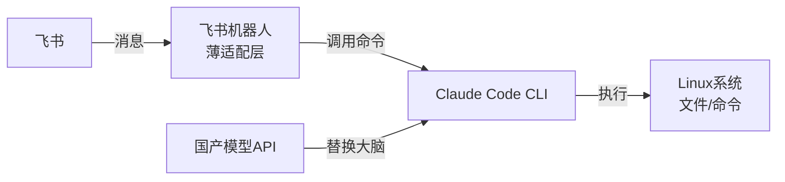
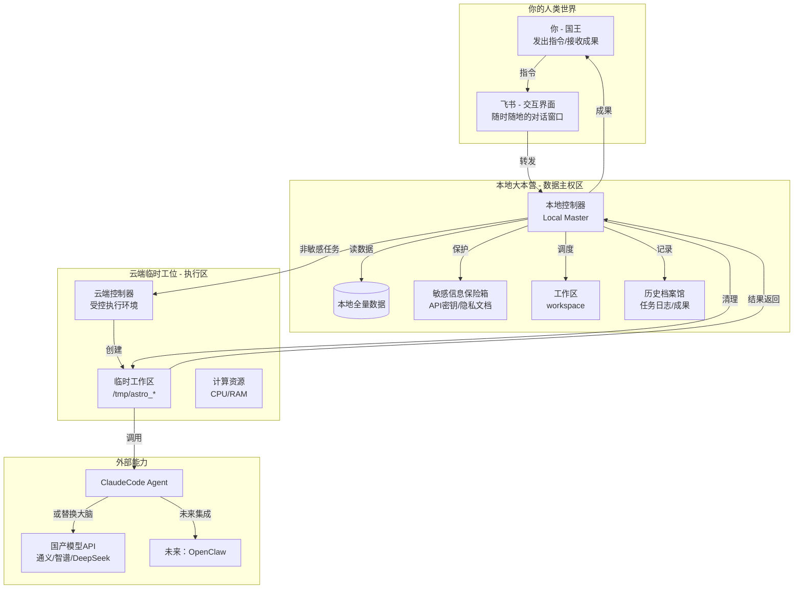
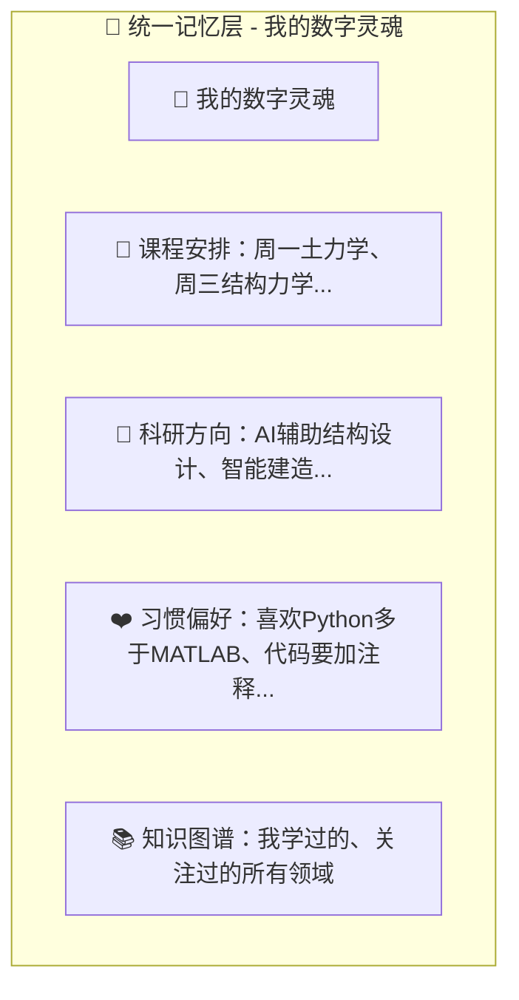
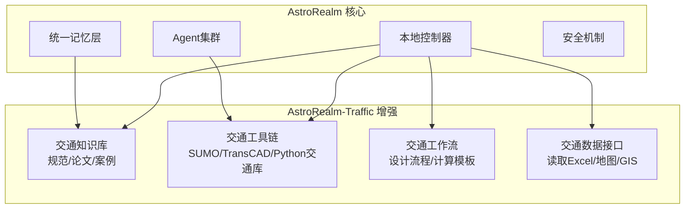

# AstroRealm：我的数字孪生伙伴

## 🚀 当前阶段更新（2026-03-29）：Stable Core v0.1 重构启动

经过最近的思考，我决定对 AstroRealm 进行一次**彻底换血**。

**核心转变**：
- 以前我是在依赖 ClaudeCode 的整个框架，再往上叠自己的逻辑 → 容易状态混乱、不稳定。
- 现在我把系统重构为 **Stable Core + Infinite Skills** 架构。

**Stable Core** 是极简、永不死亡的最小链路（接收任务 → 调用 Skill → 返回结果 → 记录日志 → 保证不死）。  
**Infinite Skills** 是所有具体功能（包括 Claude 本身），全部做成可插拔的技能包。

> **足够简单的核心 + 极其容易的插拔，造就了 AstroRealm 在各行业形成生态的可能。**

**AstroRealm = Stable Core + Infinite Skills**

这个转变让我感觉 v2.0（Obsidian 深度集成、专业模块等）突然近了很多——以后加功能不再是大改 Core，而是新增一个 Skill 即可。

**每日 Core 生长记录**：`docs/daily-core-log/`（从今天开始记录）

详细新架构说明请看：
- `docs/daily-core-log/2026-03-29-core-v0.1.md`
- `core/core_v0.1.py` + `skill_interface.py`

**仓库结构已调整**为 Core / skills / docs 分层，方便未来协作和插件式扩展。

（以下为历史记录，保留作为成长见证）

> **一个道路桥梁与渡河工程专业大二学生的AI探索之旅**
>
> 这不是一个完美的项目，而是一个真实的学习记录
> 从2026年3月13日开始，一个非科班学生的AI系统搭建实录

## 🌟 前言：为什么会有AstroRealm？

从2026年3月13日搭建成功ClaudeCode开始，到今天已经过去了十天。说长不长，说短也不短。

在这几天，可以说是发生了“翻天覆地”的变化。我记得在搭建成功ClaudeCode的那一刻，我就说这将是我人生的一个转折点——我原本随社会洪流的人生目标，在Claude成功出现的那一刻，彻彻底底地改变了。

但这次写下这个文档，我的初衷并不是想记录这一路的心酸与成长。我的目的在于，理一下这段时间在AstroRealm上的投入和改变，可以说是为AstroRealm而写的，对过去十天的狂热进行回顾，然后更好地前进和开展下一步关于Astro的工作。

**我是谁？**

* 谢鹏程（Charles），长安大学道路桥梁与渡河工程专业大二学生

* 非计算机科班出身，但热爱技术探索

* 正在构建自己的数字孪生系统：AstroRealm

## 🚀 AstroRealm的迭代史：从demo到v1.7

### 极简时间轴

```
3.13：ClaudeCode搭建成功 
  → 3.15：demo版落地 
  → 3.16：v1.0到v1.6的架构设计 
  → 3.20：v1.7定稿 
  → 3.22：Obsidian构想
```

### 第一阶段：demo - 最初的梦想

刚开始，我弄好了ClaudeCode，然后接着去接OpenClaw。当时只觉得，这个东西能搞，然后不断地搭，想了很多东西...

比如国家超算的龙虾7×24小时待命，我就想是不是可以部署一个呢？作为我的时刻在线的数字员工。然后就是了解了claude和Openclaw的安全性和架构问题，也了解到了WSL，再到Linux，了解了Linux的环境优势，越来越了解这两个，于是决定给自己弄一个单独的硬盘，专门做这个系统，既安全，又能发挥Agent的全部优势。

**于是，AstroRealm诞生了**

**初始版本**：刚开始，我想的是，在新加装的硬盘里部署Linux，然后在里面接入Agent，ClaudeCode可以在这个Linux里面连接所有的我允许的软件，给Claude指令，它就可以自主的做很多事情，实现完完全全的帮我做事。

> **我的定位**：我是物理世界的问题发现者，AstroRealm是帮我在数字世界处理问题的全模态工作助手



不过，最根本的安全问题，关于整个智能体的安全问题，所以我用了沙盒，用了权限最小化。

### 第二阶段：v1.0 - 云端大脑的设想

当系统部署在本地，当然从源头上解决了数据本地的问题，全部数据和资料都是自己可控的。

但是，倘若是用飞书进行交互的时候，如果AstroRealm的虚拟环境没有打开，这个系统也就断连运行不了了。即AstroRealm demo不能实现7×24小时随时在线工作。

于是，V1.0版本开始初显架构了——

**加入云端的服务器硬盘，对其进行架构设计，实现“本地集权，云端为辅”**——*云端大脑，本地工作台的设想出现了*



### 第三阶段：v1.5 - 智能增强

在v1.0的基础上，我开始思考如何让系统更智能。作为一个非科班学生，我需要系统能理解我的专业背景和学习需求。

**核心增强功能：**

1. **智能任务分类器** - 自动判断任务该在本地还是云端

2. **任务优先级队列** - 重要任务先执行

3. **结果自动归档系统** - 所有成果自动分类存档

4. **知识库集成** - 我的所有资料自动建立索引

5. **自动化工作流** - 预设课设/项目流程

```python
# 示例：智能任务分类器（我实际思考的代码逻辑）
class TaskClassifier:
    """
    自动判断任务该在本地还是云端
    """
    
    def classify(self, command):
        # 敏感词检测 - 保护我的隐私
        sensitive_keywords = ['密码', '密钥', '隐私', 'token', 'private']
        
        # 计算密集型关键词 - 我的专业计算需求
        compute_keywords = ['训练', '计算', '跑数据', '批量', 'simulate', '结构', '力学']
        
        if any(k in command for k in sensitive_keywords):
            return 'local_must'  # 必须在本地执行
        elif any(k in command for k in compute_keywords):
            return 'cloud_prefer'  # 优先在云端执行
        else:
            return 'local_prefer'  # 优先在本地执行
```

### 第四阶段：v1.6 - 心跳机制与统一记忆

作为一个需要兼顾学业和项目开发的学生，我需要系统能理解我的时间安排。

**v1.6的核心升级：**

1. **💓 心跳机制** - 让本地和云端真正联动

2. **🧠 统一记忆层** - 我的数字灵魂

3. **📋 任务分级系统** - 智能助理思维

4. **🔐 自动清理器** - 安全承诺可视化



### 第五阶段：v1.7 - 进阶彩蛋版

这是目前的最新版本，加入了两个让我很兴奋的功能：

1. **✨ 唤醒彩蛋** - 随叫随到的魔法

   * 你在飞书发：「开机帮我算结构力学」

   * 云端发 Wake-on-LAN 指令 → 唤醒本地电脑

   * 本地自动启动 AstroRealm → 执行任务 → 执行完自动待机

2. **👑 国王视野** - 智能墙层级

   * 一眼看到整个王国的运行状态

   * 知道"员工在不在"、"临时工忙不忙"、"现在在忙什么"

## 🧩 AstroRealm的设计核心

> **一个平台**——集成最强的Agent，永不落幕
>
> **一个血脉**——传承我的记忆，生生不息
>
> **一个主权**——我的数据，永远在我手里

### 为什么叫"数字孪生"而不是"AI助手"？

传统的AI助手只是工具，而AstroRealm是我的**数字孪生**：

* **它了解我**：知道我的课程安排、专业方向、学习习惯

* **它陪伴我**：从大二开始，记录我所有的学习和项目经历

* **它成长我**：我学到的知识，它也同步学习；我遇到的问题，它帮我解决

* **它延伸我**：将我的能力扩展到数字世界的每个角落

### 非科班视角的独特价值

作为一个道路桥梁专业的学生，我带来的视角是：

1. **工程思维**：重视系统的稳定性、安全性和可维护性

2. **实际问题导向**：所有功能都为了解决真实的学习和工作问题

3. **跨学科融合**：将AI技术与土木工程专业知识结合

4. **成长记录**：这个项目本身就是我学习过程的完整记录

## 🌉 从AstroRealm到AstroRealm-Traffic：专业融合

作为道路桥梁专业的学生，我一直在思考如何将AstroRealm与我的专业结合：



**可能的专业方向：**

* 交通运输规划与管理

* 交通信息工程及控制

* 基建系统监测

* 智能建造与维护

## 💭 我的思考与困惑

### 作为非科班学生的真实困惑

1. **Linux的"看不见"问题**：在Linux里面做开发，全是命令行，读不懂和看不懂报错才是最大的问题——意味着我都不具备驾驭系统的能力

2. **时间平衡**：如何平衡Linux开发系统学习、AI底层语言Python以及专业课程学习？

3. **知识缺口**：需要补哪些计算机基础知识？从哪里开始？

### 思维层面的成长

通过这个项目，我培养了：

* **安全思维**：数据主权、权限控制、隐私保护

* **系统思维**：从整体架构到细节实现的完整思考

* **架构思维**：模块化设计、接口定义、扩展性考虑

* **边界思维**：明确什么能做、什么不能做、为什么

## 📊 当前进展与待办清单

### ✅ 已完成

| 序号 | 项目                            | 状态 |
| -- | ----------------------------- | -- |
| 1  | Linux 虚拟环境 + Docker 沙盒        | ✅  |
| 2  | ClaudeCode 成功运行（能进行文本工作、网站搭建） | ✅  |
| 3  | LiteLLM + DeepSeek API 调用     | ✅  |
| 4  | 输入只读、输出读写的流程闭环                | ✅  |
| 5  | v1.0 到 v1.7 的完整架构设计           | ✅  |

### 📝 待优化想法

| 序号 | 想法                          | 优先级  |
| -- | --------------------------- | ---- |
| 1  | 记忆中枢（Obsidian）的接入           | 🔴 高 |
| 2  | Nebula 与 Stardust 之间的标准指令协议 | 🟡 中 |
| 3  | 双向数据同步机制                    | 🟡 中 |
| 4  | 将ClaudeCode交互界面嵌入Obsidian   | 🔴 高 |
| 5  | 针对思维过载，引入"记忆分层架构"           | 🟢 低 |
| 6  | 引入"反思Agent"——让系统自我进化        | 🟢 低 |

## 🧠 为什么开源这个项目？

1. **真实记录**：展示一个非科班学生如何从零开始构建AI系统

2. **成长见证**：这个项目会一直更新，记录我从大二到毕业的完整学习历程

3. **启发他人**：如果我能做到，其他非科班同学也能做到

4. **接受指导**：希望得到技术前辈的指导和建议

5. **寻找同伴**：找到有相似想法的同学一起探索

## 🤝 如何参与？

### 给技术大佬的建议

如果你是大佬，欢迎：

* 指出架构设计的问题

* 建议更好的实现方案

* 分享相关的技术资源

* 告诉我"这个想法很好，但是..."

### 给同路人的鼓励

如果你也是非科班学生，我想说：

* **不要怕起点低**：我也是从完全不懂Linux开始的

* **不要怕问问题**：所有问题都是学习的机会

* **保持记录**：把你的思考过程写下来，这是最宝贵的财富

* **结合专业**：把你的专业知识和AI技术结合，会有意想不到的收获

## 📞 联系我

* **GitHub**: https://github.com/Xppp-yu

* **邮箱**: 18874465065@163.com

* **博客**: AstroX的AI探索日记

* **专业**: 长安大学 道路桥梁与渡河工程 大二

> **最后的话**：
>
> 这个项目不完美，有很多稚嫩的地方，但它是真实的。
> 它记录了一个大二学生，在专业课程和AI兴趣之间的探索。
> 如果你看到了类似的想法，或者有建议，欢迎联系我。
>
> 我们一起成长。
>
> —— 谢鹏程 (Charles)
> 2026年3月26日
